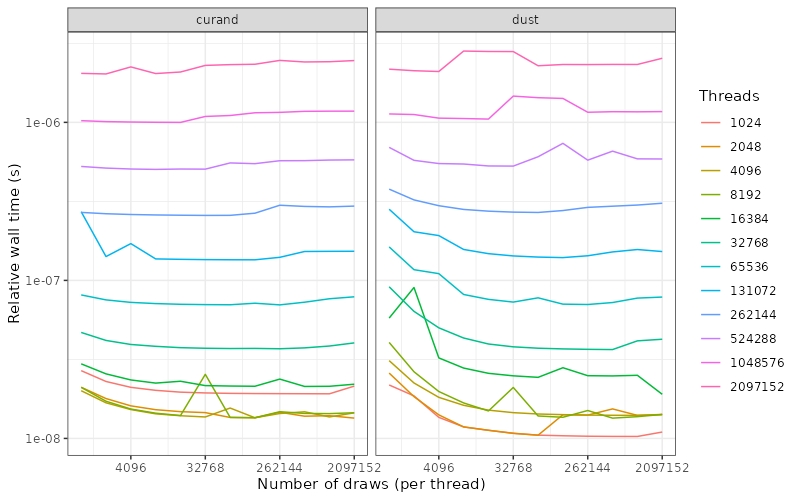

# Benchmarking dust's RNG on a GPU

This repository explores benchmarking dust's random number generator on GPU vs "curand" (the built-in random number library that we decided not to use).  Our random number generators are described [in the dust docs](https://mrc-ide.github.io/dust/articles/rng.html) and our reasons for the decisions we made are [in the last section of that document](https://mrc-ide.github.io/dust/articles/rng.html#other-packages-with-similar-functionality-1). In particular, we want random numbers that can be created identically on the CPU and GPU, do not depend on the number of threads, and which support per-draw parameter changes.

## Compilation and use

Compilation requires knowing the compute mode of your device; this will likey be

* 75 (Turing), e.g. GeForce RTX 2080 Ti
* 86 (Ampere), e.g. GeForce RTX 3090, A5000, A100

Running `./configure` with no arguments will attempt to detect this by compiling a very small program with `nvcc`. You can also force a version by running `./configure 86`.

After configuration, run `make` which will download the latest dust-random release and build two binaries (`curand` and `dustrand`).

These binaries take positional arguments `<distribution> <n_threads> <n_draws>`, for example

```
./curand uniform 16384 1000000
```

will draw 1 million uniformly distributed random numbers on _each of_ 2^14 different threads, in parallel (so a total of ~65 billion numbers).  This should take considerably less than one second.  Output looks like:

```
engine: curand, distribution: uniform, n_threads: 16384, n_draws: 1000000, t_setup: 0.00242017, t_sample: 0.0305579
```

which contains

* `engine`: either `dust` or `curand`
* `distribution`, `n_threads` and `n_draws`: as given in inputs
* `t_setup`: Wall time (in seconds) for random number initialisation, including allocations on the GPU
* `t_sample`: Wall time (in seconds) for carrying out the samples

Suported distributions are:

* both `curand` and `dustrand`: `uniform`, `normal_box_muller`, `poisson`
* `dustrand` only: `normal_polar`, `normal_ziggurat`, `exponential`, `binomial`

The script `bench.py` will run the benchmark programs with varying `n_threads` and `n_draws` to create the file `data/uniform.csv` (this script requires python3 but only standard modules).  This should require a minute or so to run.

The script `plot.R` will make some plots with this output.

## Results

Setup cost is linear in the number of threads for dust, nonlinear for curand. In both cases, the time taken is nontrivial where the number of samples drawn will be low.


For both engines as the number of draws increase we approach a stable time per sample. The 'y' here is the walltime divided by the number of draws taken, which is flat when the per-draw time is constant. The dust graph shows an overhead with small numbers of threads and small numbers of draws per thread.



Performance for the two generators is very siumilar, with the ratio of performance approaching 1 over a range of number of number of threads. curand does better for small numbers of draws per thread, dust genreally seems to do slightly better for very large numbers of threads or large numbers of draws per threads.


## Profiling

You can also profile these kernels with `ncu`.  First, make sure to compile with profiling enabled:

```
./configure --enable-profiler
make clean all
```

Then run like

```
ncu -o profile-uniform-dust --set full ./dustrand uniform 131072 1000000
ncu -o profile-uniform-curand --set full ./curand uniform 131072 1000000
```
